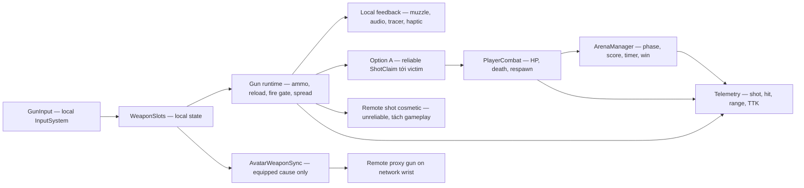

# TOSSZONE — Playable Ready Roadmap

> Status: APPROVED FOR TASKING — Option A hit contract locked 2026-07-14  
> Baseline: GDD v0.3 · Technical Review 2026-07-13 · Gun Architecture v1.0  
> Mục đích: xác định một đích **Playable Ready** có thể kiểm chứng, kiến trúc đích tối thiểu,
> các milestone và ba vòng test bắt buộc trước khi gắn nhãn Ready.

## 1. Quyết định sản phẩm của roadmap này

### Đích cần đạt

**Playable Ready** là một vertical slice VR multiplayer FPS đủ hoàn chỉnh để đưa cho người mới
chơi thử mà không cần developer đứng cạnh hướng dẫn hoặc sửa trạng thái bằng cheat/debug tool.

Playable Ready **không phải** toàn bộ GDD v0.3. Bản Ready chỉ cần chứng minh:

1. 2–4 người vào cùng một trận ổn định.
2. Di chuyển, ngắm và bắn trong VR thoải mái.
3. Gunplay có phản hồi rõ, damage/death/respawn nhất quán qua mạng.
4. Người chơi hiểu sự khác nhau giữa các vũ khí đại diện.
5. Ít nhất một lựa chọn ability bổ trợ gunplay mà không thay thế gunplay.
6. Match có bắt đầu, điều kiện thắng, kết thúc và chơi lại/thoát rõ ràng.
7. Có telemetry và evidence đủ để quyết định giữ, sửa hoặc cắt feature.

### Scope của Playable Ready

- Một map arena greybox/art-pass nhẹ, tầm giao tranh chính 5–15m.
- Một mode: **Đấu Nhanh**.
- 2–4 người, ưu tiên test chuẩn với 4 người.
- Bốn vũ khí đại diện: Lục Chuẩn, SMG Nhanh, AR Chuẩn, Dao.
- Ba slot: primary, secondary, melee.
- Simplified reload + auto-reload khi hết đạn.
- Damage, death, respawn, spawn protection.
- Hitmarker, impact feedback, audio, haptic và damage direction tối thiểu.
- Tối đa hai ability sau khi gun loop đã pass; ability đầu tiên phải được test độc lập.
- Score, timer, match end và đường quay lại/chơi tiếp.
- Telemetry phục vụ ba vòng test.

### Ngoài scope trước Ready

- Vòng Kinh Tế, tiền và reconnect wallet.
- Leo Súng.
- Heavy, burst variants, sniper, scope và trục map >20m.
- Full manual reload.
- Skin/economy/meta progression/ranking.
- Pointer shop hoặc lobby ba cổng bản hoàn chỉnh.
- Host migration guarantee cho economy mode.
- Anti-cheat production, kick/ban hoặc server-authoritative competitive stack.

Các mục ngoài scope được giữ trong product backlog sau Ready, không được chen vào milestone hiện tại
nếu không có quyết định thay đổi scope rõ ràng.

## 2. Phân loại trạng thái hiện tại

### Fact đã xác nhận từ code/docs

- Project dùng Unity 6000.3, Fusion 2.0.12 Shared Mode, không có Physics Addon.
- LocalPlayer và NetworkAvatar đã tách; head/wrist/root được replicate, IK/juice chạy local.
- ArenaManager đã có phase, round, score và timer networked.
- PlayerCombat đã có networked combat state, nhưng `Health` hiện mang nghĩa lives chứ chưa phải 100 HP.
- EquippedIndex, held visual/proxy weapon, hit RPC, melee và locomotion đã có pattern tái sử dụng.
- Task Board Editor vẫn tồn tại nhưng ba file backlog active chưa được khởi tạo.

### Recommendation của roadmap — chưa tự coi là quyết định user

- Súng dính tay bằng cosmetic parenting; không dùng AutoHand Grabbable cho gun.
- Phase đầu dùng một tay để chứng minh fire loop; foregrip là gate trước khi đánh giá AR/SMG chính thức.
- Iron/holo sight thay render-texture scope trên Quest.
- Playable Ready dùng 100 HP để stat/TTK trong GDD có nghĩa nhất quán.
- Feedback bắn chạy local ngay; kết quả gameplay đi qua contract network đã chốt.

### Decision gate phải chốt

| Gate | Cần quyết | Chặn milestone |
|---|---|---|
| D1 HIT-AUTHORITY — **CLOSED: Option A** | Shooter raycast và gửi `ShotClaim`; victim State Authority validate rồi write Health | M1 network damage trở đi |
| D2 CHEAT-SCOPE — **CLOSED: casual/small-room** | Sanity check + telemetry; không server rewind, kick/ban hay competitive guarantee trong Ready | Contract hit + Ready risk |
| D3 HEALTH-MODEL | Chuyển lives thành 100 HP và tách death/round state | M1 damage/TTK/UI |
| D4 TWO-HAND-V1 | Foregrip có bắt buộc trong Ready hay chỉ sau Ready | M2 weapon comparison |
| D5 SHOP-INTERACTION | Wrist shop, pointer shop hay không có shop trong Quick Match | Sau Ready; không chặn M1–M3 |

### Quyết định đã khóa — Option A hit contract

- Shooter raycast local và phát muzzle/audio/haptic/tracer ngay trong frame bắn.
- Khi ray trúng player, shooter gửi reliable targeted `ShotClaim` tới State Authority của victim.
- `ShotClaim` chỉ mang bằng chứng hit: `shotId`, `weaponId`, `origin`, `direction`, `hitPoint`, `hitPart`,
  `clientTick`; **không mang final damage đáng tin cậy**.
- Victim dedupe `shotId`, kiểm tra trạng thái round/shooter, equipped weapon, fire-rate, range, hit part và
  spawn protection; sau đó tự tra damage/falloff/headshot từ `GunCatalog` và write `Health`.
- Death/kill/score chỉ phát sinh sau khi victim xác nhận damage và chuyển sang dead state.
- Remote shot cosmetic dùng unreliable RPC riêng; mất cosmetic packet không làm mất damage.
- Đây là trust-client có sanity layer cho 2–4 người, không phải competitive anti-cheat. Nếu mục tiêu đổi sang
  ranked/public competitive thì phải mở ADR mới và chạy lại Test Round 1.

## 3. Target architecture cho Playable Ready

### Ranh giới bắt buộc

1. **Local responsiveness:** input, recoil hình ảnh, muzzle, audio và haptic không chờ network.
2. **Network truth:** damage, death, score và match phase chỉ thay đổi qua contract authority đã chốt.
3. **Sync cause, not mesh:** network chỉ sync equipped slot/state tối thiểu; proxy dựng model local.
4. **Gun data-driven:** semi/auto/burst là config; chỉ tạo behavior code mới khi state machine thực sự khác.
5. **Không gun physics:** gun không rơi, không grab, không transfer authority, không cần NetworkObject riêng.
6. **Bill.Events là local bus:** event cần hiển thị trên client nào phải được fire trong process client đó.
7. **Verification-first:** mỗi lớp phải test được độc lập trước khi nối lớp tiếp theo.

### Kiến trúc tối thiểu theo thời điểm

Không build toàn bộ blueprint 14 file ngay lập tức. Mỗi milestone chỉ mở phần cần thiết:

- M1: config + một hitscan runtime + input + local feedback + hit contract tối thiểu.
- M2: slots/reload/spread/falloff/headshot + remote proxy + telemetry + ability contract.
- M3: hardening, match flow, onboarding, regression và evidence.
- SpinUpGun/BoltActionGun/Fx skin hooks chỉ mở sau Ready.

## 4. Version train

| Version | Tên | Mục tiêu | Điều kiện phát hành |
|---|---|---|---|
| `v0.3-P0` | Network Gun Proof | Một AR tạo được combat loop giữa 2 client | Test Round 1 pass |
| `v0.3-P1` | Combat Playable | Quick Match với weapon choice cơ bản và loop lặp lại | Test Round 2 pass |
| `v0.3-RC1` | Ready Candidate | Session end-to-end cho người mới, có telemetry và hardening | Sẵn sàng chạy Round 3 |
| `v0.3-READY` | Playable Ready | Vertical slice đủ ổn định để external playtest | Test Round 3 pass, không còn Ready blocker |

Version chỉ được nâng khi có evidence. Compile thành công hoặc hoàn thành checklist code không đủ để
nâng version.

## 5. Milestone 0 — Decision & Test Harness

### Outcome

Loại bỏ các quyết định có khả năng khiến combat layer phải viết lại và chuẩn bị môi trường test lặp lại.

### Trong scope

- D1 HIT-AUTHORITY và D2 CHEAT-SCOPE đã chốt theo Option A; còn chốt D3 HEALTH-MODEL.
- Ghi contract hit/damage dạng dữ liệu: input, authority, validation, failure response, telemetry.
- Chuẩn bị một arena test, một AR placeholder, body/head target và hai client test path.
- Định nghĩa log/event tối thiểu: shot, hit accepted/rejected, damage, death, respawn, RTT nếu có.
- Khởi tạo Task Board active sau khi roadmap được duyệt.

### Exit gate

- Không còn câu hỏi “ai được quyền write damage”.
- Có recipe chạy hai client lặp lại được.
- Có cách phân biệt bug hit, bug damage và bug feedback trong log.

M0 không phải một playable version và không tính là một trong ba test round.

## 6. Milestone 1 — `v0.3-P0 Network Gun Proof`

### Core hypothesis

Hai người có thể bắn nhau bằng một AR trong VR với phản hồi tức thì và kết quả damage/death/respawn
nhất quán đủ để tiếp tục đầu tư gun system.

### Trong scope

- Một AR hitscan placeholder.
- Súng dính tay một tay; chưa foregrip.
- Fire gate, RPM, một magazine và auto/simple reload tối thiểu.
- Local muzzle/audio/haptic/tracer.
- Remote thấy đúng gun proxy và shot cosmetic.
- Damage → death → respawn theo D1/D3 đã chốt.
- Hitmarker và victim feedback tối thiểu.
- Telemetry combat bắt buộc.

### Ngoài scope

Weapon swap, ability, shop, jump, economy, balance nhiều súng, full map art.

### Test Round 1 — Technical Validation

- Setup: 2 Quest/client, một arena greybox, fixed AR loadout.
- Thời lượng: tối thiểu 20 phút hoặc 30 chu kỳ kill→respawn.
- Network: chạy một lượt LAN/tốt và một lượt simulated/realistic latency nếu tooling cho phép.

**Pass khi đồng thời đạt:**

1. 30/30 chu kỳ damage→death→respawn hoàn tất, không stuck và không duplicate death.
2. Không có hit accepted sau respawn protection hoặc sau khi round đã khóa combat.
3. Hai client thống nhất người sống/chết và score sau mỗi chu kỳ.
4. Local fire feedback xuất hiện trong frame bóp cò; không chờ RPC mới phát súng.
5. Remote proxy gun/tracer không sai slot và không tồn tại stale visual sau respawn.
6. Không crash, disconnect hoặc blocker severity cao trong phiên test.
7. Log đủ để giải thích mọi hit bị reject; không có reject “không rõ nguyên nhân”.

**Fail action:** không thêm súng hoặc ability. Sửa đúng lớp fail (input/feedback/hit/damage/lifecycle),
reset build về `v0.3-P0` và chạy lại toàn bộ Round 1.

## 7. Milestone 2 — `v0.3-P1 Combat Playable`

### Core hypothesis

Weapon choice và nhịp combat tạo ra quyết định rõ ràng, không chỉ là một tech demo bắn được.

### Trong scope

- Lục Chuẩn, SMG Nhanh, AR Chuẩn, Dao.
- Ba slot, swap khoảng 0.5s và cancel reload khi swap.
- Reload input + auto-reload safety net.
- Spread/bloom, damage falloff, headshot theo contract đã chốt.
- Movement multiplier theo weapon nếu không làm hỏng comfort.
- Foregrip/two-hand chỉ khi D4 được duyệt; nếu chưa duyệt phải ghi rõ build test một tay.
- Quick Match: respawn nhanh, 12 kill hoặc 5 phút.
- Một ability hỗ trợ gunplay để test trước; ability thứ hai chỉ mở nếu ability đầu pass.
- Map greybox có ít nhất một lane <8m và một lane 12–15m.
- Telemetry: kill/weapon/range, hit rate/range, TTK, misinput, ability usage, match duration.

### Test Round 2 — Combat & Fun Validation

- Setup: 4 người, ưu tiên người đã quen VR; 6 match trên cùng build/map.
- Match đầu khóa AR để tạo baseline; các match sau cho chọn loadout.
- Quan sát hành vi thật, không giải thích chiến thuật trong lúc chơi.

**Pass khi đồng thời đạt:**

1. Median body-shot TTK ở đúng tầm vai trò nằm trong hypothesis 0.6–1.0s.
2. Ít nhất 60% kill đến từ gun; ability không trở thành nguồn kill chính.
3. Không weapon nào chiếm hơn 70% kill hoặc 70% lựa chọn qua sáu match.
4. SMG và AR có kill ở khoảng cách vai trò khác nhau; dữ liệu không cho thấy một khẩu đúng ở mọi tầm.
5. Misinput swap/reload trung bình dưới 2 lần/người/match.
6. 0 ca motion sickness do mechanic mới; nếu liên quan jump thì jump bị tắt ngay.
7. Ít nhất 3/4 người đồng ý chơi thêm một match khi được hỏi không dẫn dắt.
8. Không có blocker network/combat tái hiện trong hai match liên tiếp.

**Fail action:** chỉ chỉnh một nhóm knob mỗi iteration (damage/RPM, spread, range hoặc input). Không
thêm content để che lỗi core loop. Chạy lại tối thiểu sáu match sau thay đổi balance lớn.

## 8. Milestone 3 — `v0.3-RC1 Ready Candidate`

### Core hypothesis

Người mới có thể tự đi từ mở game đến kết thúc một session, hiểu vì sao thắng/thua và muốn quay lại,
trong khi build đủ ổn định để external playtest.

### Trong scope

- Luồng join/spawn/loadout/match/end/replay-or-return hoàn chỉnh.
- Chọn tay thuận và mapping không tạo blocker; handedness còn lại phải được ghi limitation rõ nếu chưa đủ.
- Hai ability chỉ khi mỗi ability có contract, counterplay và telemetry.
- Spawn room/one-way protection, protection mất khi bắn.
- Scoreboard/end state và đường thoát khỏi match.
- Performance/Quest pass, log sạch ở release-like build.
- Regression checklist cho late join, disconnect, round end, respawn và scene transition.
- Không bắt buộc economy, Gun Game, sniper hoặc full lobby art.

### Test Round 3 — Ready Validation

- Setup: 4 người chưa chơi build hiện tại; release-like Quest build; không dùng cheat/debug panel.
- Thời lượng: onboarding + tối thiểu 3 match liên tiếp hoặc 45 phút.
- Facilitator chỉ quan sát, không hướng dẫn trừ lỗi an toàn/phần cứng.

**Pass khi đồng thời đạt:**

1. Từ mở game đến phát súng đầu tiên dưới 90 giây cho ít nhất 3/4 người.
2. 4/4 người hoàn thành một match; ít nhất 3/4 hoàn thành cả ba match không cần developer can thiệp.
3. Sau session, ít nhất 3/4 giải thích đúng vai trò cơ bản của pistol/SMG/AR.
4. Ít nhất 2/4 tự chọn replay hoặc nói muốn chơi thêm mà không được gợi ý.
5. Người chết xác định đúng nguyên nhân chính trong ít nhất 80% death được hỏi ngay sau tình huống.
6. 0 crash, save/state corruption, soft-lock hoặc blocker gameplay.
7. Không còn issue severity cao chưa có workaround; issue trung bình phải có owner/plan rõ.
8. Performance đạt target Quest đã chốt cho project trong toàn bộ combat session; không dùng cảm giác để pass.
9. Telemetry đủ dữ liệu và không mất event trọng yếu trong cả ba match.

**Fail action:** giữ nhãn RC, không gắn Ready. Fix blocker/clarity/onboarding, chạy regression nội bộ,
sau đó chạy lại Round 3 với nhóm người mới khác nếu thay đổi ảnh hưởng hành vi người chơi.

## 9. Definition of Ready — `v0.3-READY`

Chỉ gắn nhãn `v0.3-READY` khi:

- Round 1, Round 2 và Round 3 đều Pass trên build lineage hiện hành.
- Không có blocker hoặc risk HIGH/CRITICAL chưa được xử lý/chấp nhận rõ.
- Decision D1–D4 đã chốt hoặc có limitation được user chấp nhận bằng văn bản.
- Acceptance evidence được lưu: build id, thiết bị, người test, log, metric và clip/screenshot cần thiết.
- Core loop không phụ thuộc cheat/debug command để bắt đầu, tiếp tục hoặc kết thúc.
- Có known-issues list ngắn và không mục nào phá core hypothesis.
- Tài liệu GDD/Tech Architecture được cập nhật nếu implementation khác quyết định cũ.
- Task Board không đánh dấu Done cho task chưa verify.

Ready nghĩa là **sẵn sàng external playable test**, không có nghĩa content-complete hoặc ship-ready.

## 10. Regression rules giữa các vòng

- Thay đổi D1 hit authority, D3 health model hoặc death/respawn lifecycle ⇒ chạy lại Round 1.
- Thay đổi fire model, input mapping, weapon stats lớn, foregrip hoặc ability damage ⇒ chạy lại Round 2.
- Thay đổi onboarding, scene flow, lobby/loadout, match end hoặc Quest performance ⇒ chạy lại Round 3.
- Thay đổi xuyên nhiều tầng ⇒ chạy lại mọi vòng bị ảnh hưởng theo thứ tự 1→2→3.
- Không cherry-pick metric pass từ các build khác nhau để tuyên bố Ready.

## 11. Chuyển roadmap thành Task Board

Sau khi roadmap được duyệt:

1. Khởi tạo mới `Docs/TOSSZONE_TaskBreakdown.md` với M0→M3 theo đúng thứ tự, không phục hồi backlog deprecated.
2. Khởi tạo `Docs/tasks.meta.json` rỗng đúng schema.
3. Tạo task theo outcome/verify recipe, không tạo một task lớn “Implement Gun System”.
4. Mỗi task sửa code phải có dependency “GitNexus impact trước edit”.
5. Chỉ một implementation task `[/]` tại một thời điểm.
6. Export `Docs/tasks.json` bằng Unity Task Board sau mỗi thay đổi backlog đáng kể.
7. Round test là task gate riêng; chỉ Pass mới mở milestone kế tiếp.

## 12. Next smallest decision/action

Chốt D3 **HEALTH-MODEL**, đồng thời dựng two-client test harness và telemetry contract cho `ShotClaim`.
D1/D2 đã đủ rõ để task hóa M0 và `v0.3-P0`; M2/M3 vẫn đóng cho tới khi Test Round 1 Pass.
